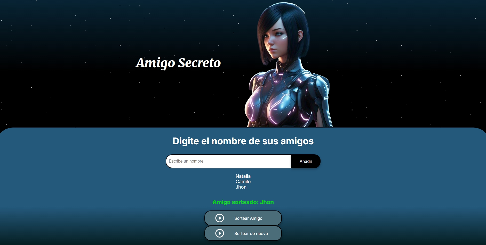

## Amigo Secreto 
Este proyecto consiste en que pones el nombre de tus amigos de 3 a
más amigos en donde se sortean aleatoriamente y al momento de sortearlos todos recuerda que puedes sortear de nuevo, además aparecera una alerta donde te indicara que todos tus amigos ya se han sorteado.
## 🔨 Funcionalidades del proyecto
Indica tu amigo secreto y tambien te advierte cuando ya se sortean todos tus amigos, cuando el espacio esta en blanco y cuando has puesto menos de 3 amigos, ademas se adapata segun el dispositivo en que lo vean

!

## ✔️ Tecnologías utilizadas

Estas fueron las tecnologías utilizadas: 

- `JavaScript`
- `HTML5`: 
  - `CSS`: 
